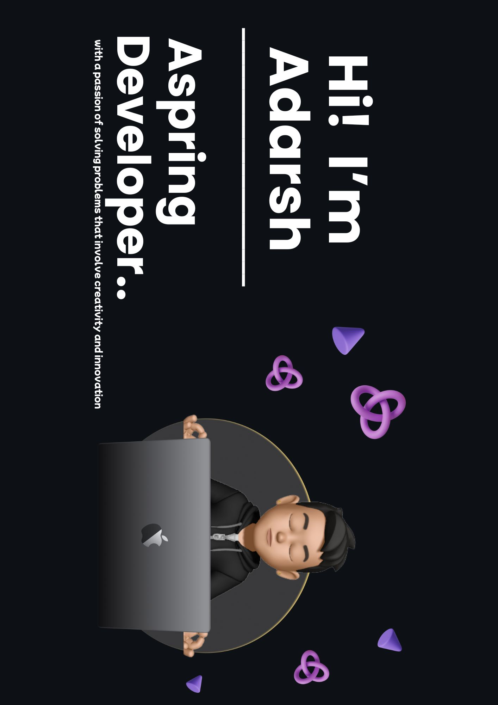

<!-- ╔══════════════════════════════════════════════════════════════════╗ -->
<!--         ADARSH KUMAR — GitHub Profile README  ·  2025 Edition       -->
<!-- ╚══════════════════════════════════════════════════════════════════╝ -->

<!-- ════════════════════  HEADER BANNER  ════════════════════ -->
<div align="center">
  
  
</div>

<!-- ════════════════════  BLOB + TYPING  ════════════════════ -->
<div align="center">
  
  <br/>
  <a href="https://git.io/typing-svg">
    
  </a>
</div>

<br/>

<!-- ════════════════════  VISITOR BADGES  ════════════════════ -->
<div align="center">
  
  &nbsp;
  <a href="https://github.com/Adarshukumar?tab=followers">
    
  </a>
  &nbsp;
  <a href="https://github.com/Adarshukumar">
    
  </a>
</div>

<br/>

---

<!-- ════════════════════  ABOUT ME  ════════════════════ -->


### 👋 &nbsp; Hey, I'm Adarsh!

```yaml
╔══════════════════════════════════════════════════╗
  name      :  Adarsh Kumar
  handle    :  @Adarshukumar
  role      :  AI Developer & ML Engineer
  instagram :  adarshu.io
  location  :  India  🇮🇳
  vibe      :  Building AI that actually helps people
╚══════════════════════════════════════════════════╝

about_me   :  >
  I'm a developer who loves turning crazy ideas
  into real AI-powered things. I enjoy building,
  breaking, and learning — repeat forever 🔄

what_i_love:
  ·  Artificial Intelligence & LLMs  🤖
  ·  Machine Learning & Deep Learning 🧠
  ·  Full Stack AI Applications       🌐
  ·  Clean APIs & Backend Systems     ⚙️

right_now:
  🔭  Building autonomous AI agents
  🌱  Going deeper into RAG + LangChain
  🤝  Always open for cool collabs
  ⚡  Shipping things fast & learning faster

fun_fact   : "I debug with print() — zero regrets 🛠️"
coffee_lvl : "☕☕☕ always"
motto      : "Ship it, learn from it, do it better 🚀"
```

<br clear="right"/>

---

<!-- ════════════════════  CONNECT WITH ME  ════════════════════ -->

## 🌐 &nbsp; Connect With Me

<div align="center">
  
</div>

<br/>

<!-- ── All icons from GitHub-hosted CDN — loads 100% reliably ── -->
<p align="center">

  <a href="https://linkedin.com/in/adarshu07" title="LinkedIn">
    
  </a>&nbsp;&nbsp;&nbsp;

  <a href="https://open.spotify.com/user/Adarshukumar" title="Spotify">
    
  </a>&nbsp;&nbsp;&nbsp;

  <a href="https://github.com/Adarshukumar" title="GitHub">
    
  </a>&nbsp;&nbsp;&nbsp;

  <a href="https://instagram.com/adarshu.io" title="Instagram">
    
  </a>&nbsp;&nbsp;&nbsp;

  <a href="https://x.com/Adarshukumar07" title="X / Twitter">
    
  </a>

</p>

<p align="center">

  <a href="https://youtube.com/@Adarshukumar" title="YouTube">
    
  </a>&nbsp;&nbsp;&nbsp;

  <a href="https://discord.com/users/Adarshukumar" title="Discord">
    
  </a>&nbsp;&nbsp;&nbsp;

  <a href="mailto:adarshukumar@gmail.com" title="Gmail">
    
  </a>&nbsp;&nbsp;&nbsp;

  <a href="https://huggingface.co/AdarshJi" title="HuggingFace">
    
  </a>&nbsp;&nbsp;&nbsp;

  <a href="https://linktr.ee/adarshu" title="Linktree">
    
  </a>&nbsp;&nbsp;&nbsp;

  <a href="https://Adarshukumar.itch.io" title="Itch.io">
    
  </a>

</p>

---

<!-- ════════════════════  TECH ARSENAL  ════════════════════ -->

## 🛠️ &nbsp; Tech Arsenal


<details open>
<summary><b>🤖 &nbsp; AI / Machine Learning</b></summary>
<br/>
<div align="center">


</div>
<br/>
</details>

<details open>
<summary><b>🌐 &nbsp; Backend & APIs</b></summary>
<br/>
<div align="center">


</div>
<br/>
</details>

<details open>
<summary><b>💻 &nbsp; Languages & Frontend</b></summary>
<br/>
<div align="center">


</div>
<br/>
</details>

<details open>
<summary><b>🗄️ &nbsp; Databases & Cloud</b></summary>
<br/>
<div align="center">


</div>
<br/>
</details>

<br clear="right"/>

---

<!-- ════════════════════  WHAT I'M BUILDING  ════════════════════ -->

## 🚀 &nbsp; What I'm Building

<br/>
<div align="center">
<table>
  <tr>
    <td align="center" width="200">
      <h3>🤖</h3>
      <b>AI Agents</b><br/><br/>
      <sub>Autonomous LLM-powered<br/>multi-step reasoning agents</sub>
    </td>
    <td align="center" width="200">
      <h3>🧠</h3>
      <b>RAG Pipelines</b><br/><br/>
      <sub>Retrieval-Augmented<br/>Generation systems</sub>
    </td>
    <td align="center" width="200">
      <h3>⚡</h3>
      <b>AI APIs</b><br/><br/>
      <sub>Production FastAPI<br/>+ ML microservices</sub>
    </td>
    <td align="center" width="200">
      <h3>🎮</h3>
      <b>AI × Games</b><br/><br/>
      <sub>Applying ML models<br/>to game development</sub>
    </td>
  </tr>
</table>
</div>

---

<!-- ════════════════════  GITHUB STATS  ════════════════════ -->

## 📊 &nbsp; GitHub Stats

<div align="center">
  
  &nbsp;&nbsp;
  
</div>

<br/>

<div align="center">
  
</div>

<br/>

<div align="center">
  
</div>

---

<!-- ════════════════════  ACHIEVEMENTS  ════════════════════ -->

## 🏅 &nbsp; Achievements Wall

<div align="center">


<br/><br/>

<!-- Trophies — nord theme, most reliable -->


<br/><br/>

<!-- Playful achievement cards -->
<table>
  <tr>
    <td align="center" width="160">
      
      <br/><b>⭐ Rising Star</b>
      <br/><sub>Daily commits<br/>never stop 💪</sub>
    </td>
    <td align="center" width="160">
      
      <br/><b>🚀 Launcher</b>
      <br/><sub>Shipping repos<br/>like a factory 🏭</sub>
    </td>
    <td align="center" width="160">
      
      <br/><b>💫 Star Gazer</b>
      <br/><sub>Quality > quantity<br/>always ✨</sub>
    </td>
    <td align="center" width="160">
      
      <br/><b>👾 Contributor</b>
      <br/><sub>Open source<br/>all day 🌍</sub>
    </td>
  </tr>
</table>

</div>

---


<!-- ════════════════════  PYTHON BIO CARD  ════════════════════ -->

## ⚡ &nbsp;`adarsh.py`

```python
#!/usr/bin/env python3
# ─────────────────────────────────────────────────────────────────
#   Adarsh Kumar  ·  AI Developer & ML Engineer  ·  India 🇮🇳
# ─────────────────────────────────────────────────────────────────

class AdarshKumar:

    def __init__(self):
        self.name        = "Adarsh Kumar"
        self.handle      = "@Adarshukumar"
        self.role        = "AI Developer & ML Engineer"
        self.location    = "India 🇮🇳"
        self.instagram   = "instagram.com/adarshu.io"
        self.languages   = ["Python 🐍", "C++ ⚙️", "JavaScript 🌐", "C"]
        self.ai_stack    = ["LangChain 🔗", "HuggingFace 🤗", "OpenAI 🤖", "Gemini ✨"]
        self.frameworks  = ["FastAPI ⚡", "Flask 🌶️", "TensorFlow 🔥", "PyTorch 💥"]
        self.databases   = ["Firebase 🔥", "MySQL 🐬", "MongoDB 🍃", "SQLite 📦"]
        self.hobbies     = ["🤖 AI Research", "🎮 Game Dev", "📖 Learning", "🌍 Open Source"]
        self.fun_fact    = "I debug with print() — no regrets 🛠️"
        self.motto       = "Build fast. Break things. Learn faster. 🚀"

    def say_hi(self) -> str:
        return "\n".join([
            "Hey there! 👋  I'm Adarsh.",
            "I turn data + ideas into intelligent AI systems.",
            "Let's build something incredible together! 🚀"
        ])

    def available_for(self) -> list:
        return [
            "AI / ML Projects      🤖",
            "Open Source Collab    🌍",
            "Freelance AI Dev      💼",
            "Research Partnerships 🧪",
        ]

me = AdarshKumar()
print(me.say_hi())
print("\nAvailable for:")
for item in me.available_for():
    print(f"  ✅  {item}")
```

---

<!-- ════════════════════  LET'S BUILD TOGETHER  ════════════════════ -->

## 🤝 &nbsp; Let's Build Together

<div align="center">
<br/>

> *"Alone you go fast. Together you go far."*

<br/>

💼 &nbsp; Open to &nbsp; **AI/ML Projects** &nbsp;·&nbsp; **Open Source** &nbsp;·&nbsp; **Freelance** &nbsp;·&nbsp; **Research Collabs**

<br/>

<a href="mailto:adarshukumar@gmail.com">
  
</a>&nbsp;
<a href="https://instagram.com/adarshu.io">
  
</a>&nbsp;
<a href="https://linkedin.com/in/adarshu07">
  
</a>&nbsp;
<a href="https://github.com/Adarshukumar">
  
</a>

</div>

---

<!-- ════════════════════  FOOTER  ════════════════════ -->
<div align="center">
  
</div>

<div align="center">
  <sub>⭐ &nbsp; Star my repos if you find them useful &nbsp;·&nbsp; Made with 🖤 by
  <a href="https://github.com/Adarshukumar">Adarsh Kumar</a></sub>
  <br/><br/>
  
  &nbsp;
  
  &nbsp;
  
</div>
